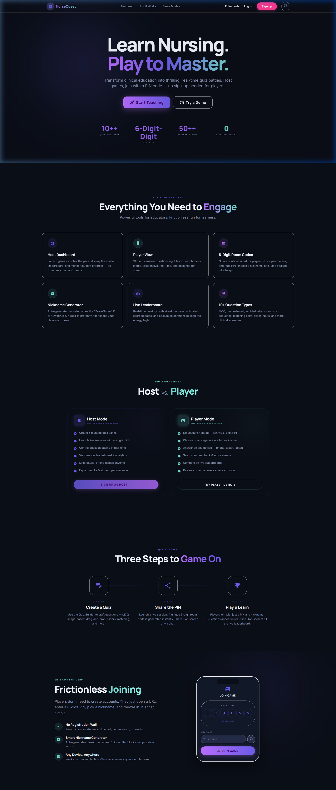
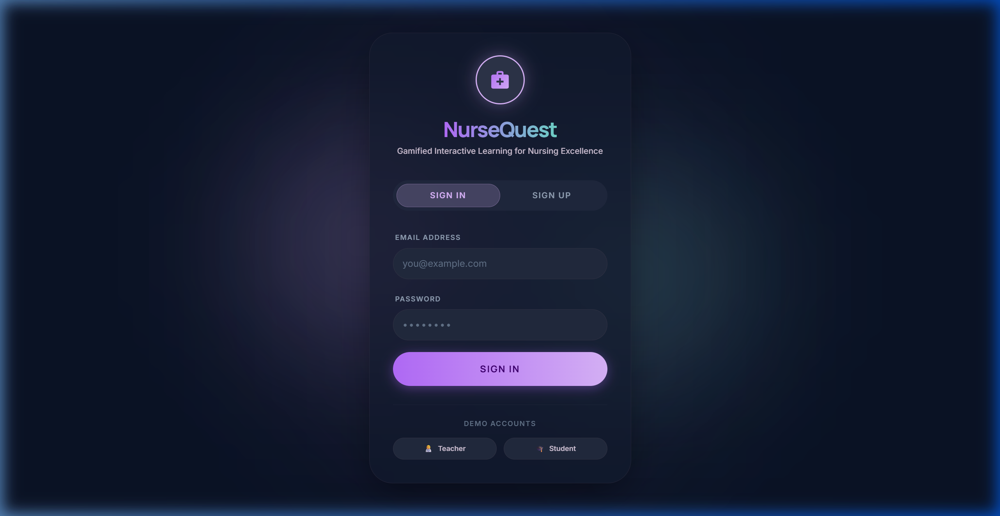
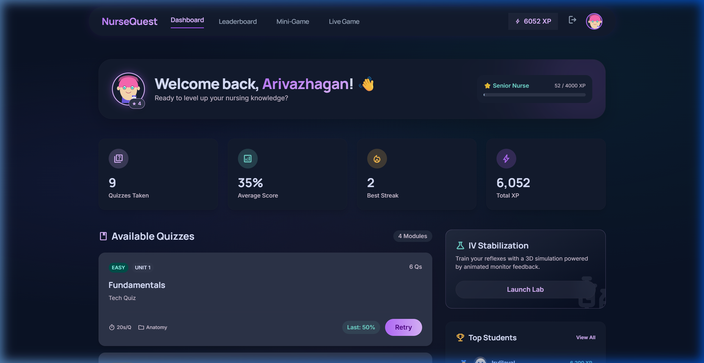
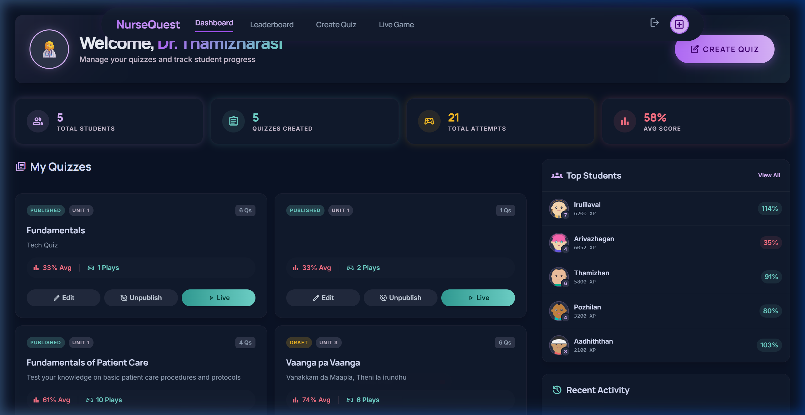
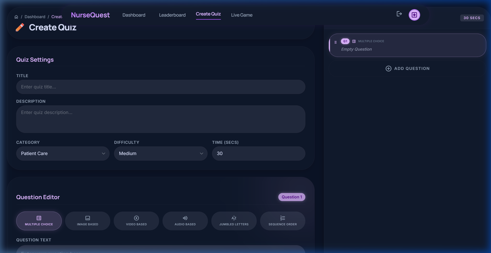
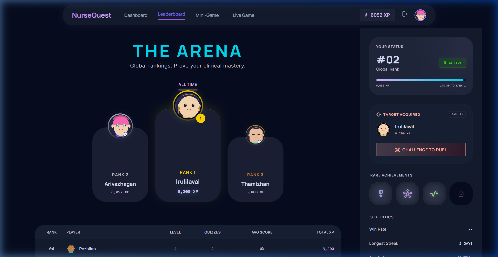
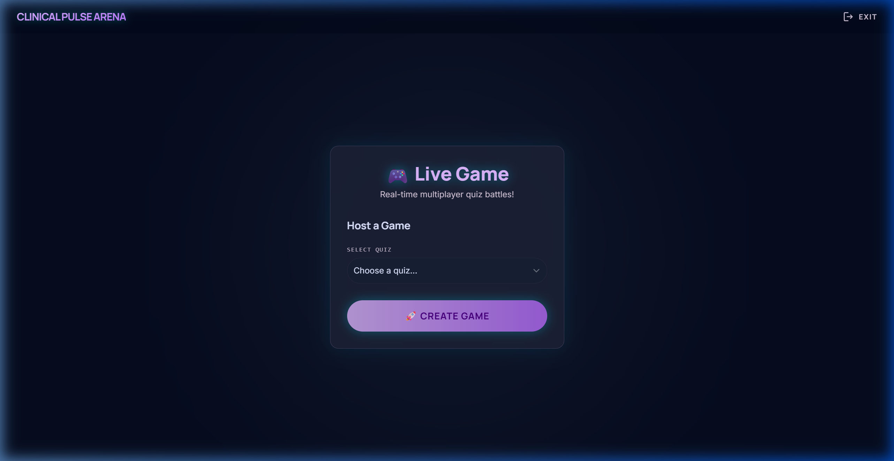
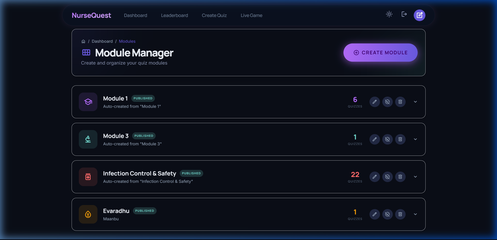

<p align="center">
  
</p>

<h1 align="center">🏥 NurseQuest</h1>
<h3 align="center">Gamified Nursing Education Platform</h3>

<p align="center">
  <strong>Transform nursing education into an interactive, competitive, and engaging experience.</strong>
</p>

<p align="center">
  
  
  
  
  
  
  
</p>

---

## 📋 Table of Contents

- [Overview](#-overview)
- [Key Features](#-key-features)
- [Screenshots](#-screenshots)
- [Tech Stack](#-tech-stack)
- [Architecture](#-architecture)
- [Project Structure](#-project-structure)
- [Getting Started](#-getting-started)
- [API Reference](#-api-reference)
- [Database Schema](#-database-schema)
- [Real-Time Events](#-real-time-events-socketio)
- [Scoring System](#-scoring-system)
- [Deployment](#-deployment)
- [Contributing](#-contributing)
- [References](#-references)
- [License](#-license)

---

## 🌟 Overview

**NurseQuest** is a full-stack, gamified web platform designed to revolutionize nursing education. It transforms traditional high-stakes medical assessments into an interactive, competitive learning experience — combining XP progression, live multiplayer quizzes, and rich multimedia question types to improve student retention and clinical readiness.

Built as an academic project, NurseQuest draws inspiration from platforms like Kahoot! while being purpose-built for the nursing curriculum — supporting clinical scenarios, anatomy challenges, and pharmacology assessments with 9 unique question formats.

### 👥 Who Is It For?

| Role | Description |
|------|-------------|
| **🎓 Nursing Students** | Study nursing concepts through gamified quizzes, earn XP, climb ranks, and compete on leaderboards |
| **👩‍🏫 Nursing Educators** | Create quizzes, manage learning modules, host live multiplayer sessions, and track student performance |

---

## ✨ Key Features

### 🎮 Gamification Engine
- **XP & Leveling** — 7 nursing ranks from _Nurse Intern_ → _Chief Nurse_
- **Daily Streaks** — Maintain consecutive-day activity for bonus rewards
- **Achievement Badges** — Unlock milestones based on quizzes completed, scores, and streaks
- **Global Leaderboard** — Podium-style rankings with animated celebrations

### 📝 Multi-Format Quiz Engine
Supports **9 question types** for diverse clinical assessment:

| Type | Description |
|------|-------------|
| ✅ Multiple Choice (MCQ) | Standard 4-option questions |
| 🖼️ Image-Based | Clinical image identification |
| 🎬 Video-Based | Video scenario assessment |
| 🔊 Audio-Based | Auscultation & audio recognition |
| 🔤 Jumbled Letters | Unscramble medical terminology |
| 🔢 Sequence Ordering | Arrange steps in correct procedure order |
| 🎚️ Slider | Numeric estimation (e.g., vital signs, dosages) |
| 🔗 Matching | Pair related medical concepts |
| 🤖 CAPTCHA | Verification challenges |

### ⚡ Live Multiplayer Sessions
- **Kahoot-style gameplay** — Teacher hosts, students join via 6-digit game code
- **Real-time synchronization** — Questions broadcast simultaneously to all players
- **Live leaderboard** — Instant rank updates after every question round
- **WebSocket-powered** — Sub-200ms latency via Socket.IO

### 📚 Content Management
- **Quiz Builder** — Rich visual editor for creating quizzes with multimedia uploads
- **Module Manager** — Organize curriculum into structured learning modules
- **Module Viewer** — Students browse and study module content

### 🎨 Premium UI/UX
- **"Clinical Luminary" Design System** — Dark glassmorphism with vibrant gradients
- **Dark / Light Theme Toggle** — User preference persisted across sessions
- **Customizable Avatars** — Character avatar builder for student identity
- **Smooth Animations** — GSAP, Three.js, Lottie, and confetti effects
- **Responsive Design** — Fully functional on desktop, tablet, and mobile

### 🔐 Security
- **JWT Authentication** — Stateless, secure token-based auth
- **Role-Based Access Control** — Separate teacher/student dashboards and permissions
- **Password Hashing** — bcrypt-based password security

---

## 📸 Screenshots

<table>
  <tr>
    <td align="center" width="50%">
      
      <br/><strong>Landing Page</strong>
    </td>
    <td align="center" width="50%">
      
      <br/><strong>Login / Register</strong>
    </td>
  </tr>
  <tr>
    <td align="center">
      
      <br/><strong>Student Dashboard</strong>
    </td>
    <td align="center">
      
      <br/><strong>Teacher Dashboard</strong>
    </td>
  </tr>
  <tr>
    <td align="center">
      
      <br/><strong>Quiz Builder</strong>
    </td>
    <td align="center">
      
      <br/><strong>Leaderboard</strong>
    </td>
  </tr>
  <tr>
    <td align="center">
      
      <br/><strong>Live Multiplayer Session</strong>
    </td>
    <td align="center">
      
      <br/><strong>Module Manager</strong>
    </td>
  </tr>
</table>

---

## 🛠️ Tech Stack

| Layer | Technology | Purpose |
|-------|-----------|---------|
| **Frontend** | React 19, Vite 8 | Component-based SPA with HMR |
| **Routing** | React Router DOM 7 | Client-side navigation |
| **State** | React Context API | AuthContext, ThemeContext |
| **Animations** | GSAP, Three.js, Lottie | Premium motion & 3D graphics |
| **Charts** | Chart.js + react-chartjs-2 | Dashboard analytics |
| **Sound** | Howler.js | Audio feedback & effects |
| **Effects** | canvas-confetti | Celebration particles |
| **Backend** | Node.js, Express 5 | RESTful API server |
| **Auth** | JWT + bcryptjs | Token auth & password hashing |
| **Database** | SQLite (better-sqlite3) | Embedded relational storage |
| **Real-Time** | Socket.IO 4 | WebSocket bidirectional comms |
| **File Upload** | Multer | Image, video, audio uploads |
| **Dev Tools** | Nodemon, Concurrently, ESLint | DX tooling |

---

## 🏗️ Architecture

```
┌─────────────────────────────────────────────────────┐
│                   Client (Browser)                  │
│  ┌──────────────────────────────────────────────┐   │
│  │           React 19 + Vite SPA                │   │
│  │  ┌──────────┐ ┌──────────┐ ┌─────────────┐  │   │
│  │  │  Pages   │ │Components│ │  Contexts    │  │   │
│  │  │(12 views)│ │(Avatar,  │ │(Auth, Theme) │  │   │
│  │  │          │ │ Navbar)  │ │              │  │   │
│  │  └──────────┘ └──────────┘ └─────────────┘  │   │
│  │  ┌──────────────────┐  ┌─────────────────┐  │   │
│  │  │   API Client     │  │ Socket.IO Client│  │   │
│  │  │   (REST calls)   │  │ (Real-time)     │  │   │
│  │  └────────┬─────────┘  └────────┬────────┘  │   │
│  └───────────┼─────────────────────┼────────┘   │
└──────────────┼─────────────────────┼────────────┘
               │ HTTP/REST           │ WebSocket
┌──────────────┼─────────────────────┼────────────┐
│              ▼                     ▼            │
│  ┌─────────────────────────────────────────┐    │
│  │     Express 5 + Socket.IO Server        │    │
│  │  ┌──────────┐ ┌──────────┐ ┌────────┐  │    │
│  │  │  Routes  │ │Middleware│ │Socket  │  │    │
│  │  │ auth     │ │  JWT     │ │Handlers│  │    │
│  │  │ quizzes  │ │  CORS    │ │ rooms  │  │    │
│  │  │ scores   │ │  Multer  │ │ events │  │    │
│  │  │ users    │ │          │ │ state  │  │    │
│  │  │ modules  │ │          │ │        │  │    │
│  │  └─────┬────┘ └──────────┘ └────────┘  │    │
│  └────────┼────────────────────────────────┘    │
│           │                                     │
│  ┌────────▼────────┐  ┌────────────────────┐    │
│  │  SQLite Database │  │  File System       │    │
│  │  (better-sqlite3)│  │  uploads/          │    │
│  │  • users         │  │  ├── images/       │    │
│  │  • quizzes       │  │  ├── videos/       │    │
│  │  • questions     │  │  └── audio/        │    │
│  │  • attempts      │  │                    │    │
│  │  • live_sessions │  │                    │    │
│  │  • achievements  │  │                    │    │
│  └──────────────────┘  └────────────────────┘    │
│              Backend Server (:3001)               │
└───────────────────────────────────────────────────┘
```

---

## 📁 Project Structure

```
NurseQuest/
├── backend/                    # Express API + Socket.IO server
│   ├── server.js               # Express app setup, routes, static serving
│   ├── socket.js               # Socket.IO event handlers (live game logic)
│   ├── package.json            # Backend dependencies
│   ├── db/
│   │   ├── schema.sql          # Full database schema (10 tables)
│   │   ├── init.js             # Database initialization
│   │   ├── seed.js             # Sample data seeder
│   │   ├── import_questions.js # Bulk question importer
│   │   └── migrate_*.js        # Schema migration scripts
│   ├── middleware/
│   │   └── auth.js             # JWT verification middleware
│   ├── routes/
│   │   ├── auth.js             # POST /api/auth/register, /login, /me
│   │   ├── quizzes.js          # CRUD for quizzes & questions
│   │   ├── scores.js           # Quiz attempts & leaderboard
│   │   ├── users.js            # User profiles & avatar updates
│   │   └── modules.js          # Learning module CRUD
│   ├── utils/
│   │   └── scoring.js          # XP calculation & scoring algorithms
│   └── uploads/                # User-uploaded media (images, videos, audio)
│
├── frontend/                   # React SPA (Vite)
│   ├── index.html              # Entry HTML with meta tags
│   ├── vite.config.js          # Vite configuration
│   ├── package.json            # Frontend dependencies
│   └── src/
│       ├── main.jsx            # React DOM mount point
│       ├── App.jsx             # Root component with routing
│       ├── index.css           # Global styles & design system
│       ├── api/
│       │   └── client.js       # Axios/Fetch API wrapper
│       ├── contexts/
│       │   ├── AuthContext.jsx  # Authentication state provider
│       │   └── ThemeContext.jsx # Dark/Light theme provider
│       ├── components/
│       │   ├── Navbar.jsx      # Navigation bar
│       │   └── Avatar.jsx      # Customizable avatar renderer
│       ├── pages/
│       │   ├── LandingPage.jsx      # Marketing / hero landing
│       │   ├── AuthPage.jsx         # Login & registration
│       │   ├── AvatarSetup.jsx      # Avatar customization flow
│       │   ├── StudentDashboard.jsx # Student home (XP, stats, quizzes)
│       │   ├── TeacherDashboard.jsx # Teacher home (analytics, management)
│       │   ├── QuizBuilder.jsx      # Quiz creation & editing
│       │   ├── QuizPlayer.jsx       # Solo quiz-taking experience
│       │   ├── LiveGame.jsx         # Multiplayer game room
│       │   ├── Leaderboard.jsx      # Global rankings
│       │   ├── ModuleManager.jsx    # Teacher module CRUD
│       │   ├── ModuleView.jsx       # Student module browser
│       │   └── NursingMiniGame.jsx  # Interactive mini-game
│       └── assets/             # Static assets & Lottie animations
│
├── design/                     # Stitch HTML design mockups
├── design-showcase/            # Interactive design prototype
├── docs/                       # Documentation & reports
│   ├── nursequest_prd.md       # Product Requirements Document
│   ├── PROBLEM_STATEMENT.txt   # Technical problem statement
│   ├── references.md           # IEEE-formatted references
│   └── screenshots/            # Application screenshots
├── scripts/                    # Tooling scripts
│   ├── generate_docx.py        # Document generation
│   └── generate_progress_report.py
├── package.json                # Root monorepo scripts
└── .gitignore                  # Git ignore rules
```

---

## 📥 Quiz Import/Export Spec

NurseQuest supports bulk quiz imports from PDF, DOCX, TXT, or ZIP bundles (which can bundle clinical media like audios/videos/images alongside the quiz document).

### Boundary Detection
Questions are parsed as sequential blocks. A new question context is opened by:
1. A type tag in brackets (e.g., `[Matching]`, `[Slider]`, `[Captcha]`)
2. A numbered line matching the question format (e.g., `1. What is...`)

### Format Examples by Question Type

#### 1. Multiple Choice (MCQ)
MCQ is the default format. No type tag is required.
```text
1. What is the normal resting heart rate for an adult?
A) 40-60 bpm
B) 60-100 bpm
C) 100-120 bpm
D) 120-150 bpm
Answer: B
Explanation: The normal resting heart rate for adults ranges from 60 to 100 beats per minute.
```

#### 2. True / False
```text
[TrueFalse]
2. Hand hygiene is the single most important practice in reducing infection transmission.
Answer: True
Explanation: Hand hygiene is the cornerstone of infection prevention.
```

#### 3. Match Pairs
Pairs are defined on separate lines in the format `Key = Value`.
```text
[Matching]
3. Match the disease with the primary symptom:
Diabetes = Polyuria
Hypertension = Headache
Hypothyroidism = Weight gain
Explanation: Match symptoms accordingly.
```

#### 4. Sequence Ordering
Steps are defined sequentially with `1)`, `2)`, etc.
```text
[Sequence]
4. Order the steps for clean dressing change:
1) Perform hand hygiene
2) Apply clean gloves
3) Remove old dressing
4) Clean wound site
Explanation: Sequential order of steps.
```

#### 5. Jumbled Letters
Provide the word to be unscrambled.
```text
[Jumble]
5. Unscramble the term representing low oxygen:
Word: HYPOXIA
Explanation: Lack of oxygen.
```

#### 6. Slider
Define the range, step, and answer value.
```text
[Slider]
6. What temperature defines fever in Celsius?
Min: 35  Max: 41  Step: 0.1  Answer: 38
Unit: °C
Explanation: 38°C is considered fever.
```

#### 7. Media-Based Questions (Image, Video, Audio)
Media questions can specify a filename using `Media: filename.ext`. In a ZIP bundle, place these files inside a `media/` folder.
```text
[Image]
7. Identify the anatomical structure shown:
Media: heart_diagram.png
A) Aorta
B) Left Ventricle
C) Right Atrium
Answer: A
```

#### 8. Image CAPTCHA
Define the coordinates of the correct bounding box (x, y, width, height as float percentages of the image size).
```text
[Captcha]
8. Click on the injection site:
Media: arm.jpg
Box: 0.25, 0.45, 0.10, 0.10
Explanation: Deltoid region injection site.
```

---

## 🚀 Getting Started

### Prerequisites

- **Node.js** 18+ ([download](https://nodejs.org/))
- **npm** (included with Node.js)
- **Git** ([download](https://git-scm.com/))

### Installation

```bash
# 1. Clone the repository
git clone https://gitlab.com/swamy-tech-group/NurseQuest-project.git
cd NurseQuest-project

# 2. Install all dependencies (backend + frontend)
npm run install:all

# 3. Seed the database with sample data
npm run seed
```

### Running Locally (Development)

```bash
# Start both servers concurrently (recommended)
npm run dev
```

Or run them individually in separate terminals:

```bash
# Terminal 1 — Backend (Express + Socket.IO)
cd backend
npm run dev          # Starts on http://localhost:3001

# Terminal 2 — Frontend (Vite dev server)
cd frontend
npm run dev          # Starts on http://localhost:5173
```

| Service | URL |
|---------|-----|
| Frontend (Vite) | `http://localhost:5173` |
| Backend API | `http://localhost:3001/api` |
| WebSocket | `ws://localhost:3001` |

### Default Credentials (After Seeding)

| Role | Email | Password |
|------|-------|----------|
| Teacher | `teacher@nursequest.com` | `password123` |
| Student | `student@nursequest.com` | `password123` |

---

## 📡 API Reference

All endpoints are prefixed with `/api`.

### Authentication

| Method | Endpoint | Description | Auth |
|--------|----------|-------------|------|
| `POST` | `/api/auth/register` | Create a new account | ❌ |
| `POST` | `/api/auth/login` | Login & receive JWT | ❌ |
| `GET` | `/api/auth/me` | Get current user profile | ✅ |

### Quizzes

| Method | Endpoint | Description | Auth |
|--------|----------|-------------|------|
| `GET` | `/api/quizzes` | List all published quizzes | ✅ |
| `GET` | `/api/quizzes/:id` | Get quiz with questions | ✅ |
| `POST` | `/api/quizzes` | Create a new quiz | ✅ Teacher |
| `PUT` | `/api/quizzes/:id` | Update quiz details | ✅ Teacher |
| `DELETE` | `/api/quizzes/:id` | Delete a quiz | ✅ Teacher |
| `POST` | `/api/quizzes/:id/questions` | Add question to quiz | ✅ Teacher |
| `POST` | `/api/quizzes/import` | Upload file (PDF/DOCX/TXT/ZIP) and parse questions | ✅ Teacher |
| `POST` | `/api/quizzes/import/confirm` | Confirm and save parsed quiz questions | ✅ Teacher |
| `GET` | `/api/quizzes/:id/export` | Download quiz as DOCX, JSON, or ZIP bundle | ✅ Teacher |

### Scores & Attempts

| Method | Endpoint | Description | Auth |
|--------|----------|-------------|------|
| `POST` | `/api/scores/submit` | Submit a quiz attempt | ✅ |
| `GET` | `/api/scores/leaderboard` | Get global leaderboard | ✅ |
| `GET` | `/api/scores/my-attempts` | Get user's quiz history | ✅ |
| `GET` | `/api/scores/stats` | Get aggregated statistics | ✅ |

### Users

| Method | Endpoint | Description | Auth |
|--------|----------|-------------|------|
| `GET` | `/api/users/profile` | Get user profile | ✅ |
| `PUT` | `/api/users/avatar` | Update avatar config | ✅ |
| `GET` | `/api/users/students` | List all students | ✅ Teacher |

### Modules

| Method | Endpoint | Description | Auth |
|--------|----------|-------------|------|
| `GET` | `/api/modules` | List all modules | ✅ |
| `GET` | `/api/modules/:id` | Get module details | ✅ |
| `POST` | `/api/modules` | Create a module | ✅ Teacher |
| `PUT` | `/api/modules/:id` | Update a module | ✅ Teacher |
| `DELETE` | `/api/modules/:id` | Delete a module | ✅ Teacher |

---

## 🗄️ Database Schema

NurseQuest uses **SQLite** (via better-sqlite3) with **10 tables**:

```
┌─────────────┐    ┌──────────────┐    ┌──────────────┐
│   users      │    │   modules     │    │  achievements │
│─────────────│    │──────────────│    │──────────────│
│ id (PK)      │◄──┤ created_by    │    │ id (PK)      │
│ email        │    │ title         │    │ name         │
│ password     │    │ description   │    │ requirement  │
│ name         │    │ is_published  │    │ icon         │
│ role         │    └──────┬───────┘    └──────┬───────┘
│ avatar_config│           │                   │
│ xp, level    │    ┌──────▼───────┐    ┌──────▼───────┐
│ streak       │    │   quizzes     │    │user_achievements│
└──────┬───────┘    │──────────────│    │──────────────│
       │            │ id (PK)      │    │ user_id (FK) │
       │            │ module_id(FK)│    │ achieve_id   │
       │            │ title        │    └──────────────┘
       │            │ difficulty   │
       │            │ time_per_q   │
       │            └──────┬───────┘
       │                   │
       │            ┌──────▼───────┐
       │            │  questions    │
       │            │──────────────│
       │            │ quiz_id (FK) │
       │            │ type (9 types)│
       │            │ options (JSON)│
       │            │ correct_answer│
       │            │ media_url    │
       │            └──────────────┘
       │
┌──────▼───────┐    ┌──────────────┐
│ quiz_attempts │    │live_sessions  │
│──────────────│    │──────────────│
│ user_id (FK) │    │ quiz_id (FK) │
│ quiz_id (FK) │    │ host_id (FK) │
│ score        │    │ join_code    │
│ correct_count│    │ status       │
└──────┬───────┘    └──────┬───────┘
       │                   │
┌──────▼───────┐    ┌──────▼───────┐
│question_answers│   │live_participants│
│──────────────│    │──────────────│
│ attempt_id   │    │ session_id   │
│ question_id  │    │ user_id (FK) │
│ is_correct   │    │ score, rank  │
│ points_earned│    └──────────────┘
└──────────────┘
```

---

## 🔌 Real-Time Events (Socket.IO)

### Teacher (Host) Events

| Event | Direction | Description |
|-------|-----------|-------------|
| `create-session` | Client → Server | Create a live game room |
| `start-game` | Client → Server | Begin the quiz session |
| `next-question` | Client → Server | Broadcast next question |
| `end-game` | Client → Server | Finish the live session |
| `session-created` | Server → Client | Room created with join code |
| `player-joined` | Server → Client | New player entered room |
| `question-results` | Server → Client | Aggregated answer stats |
| `final-results` | Server → Client | Final leaderboard |

### Student (Player) Events

| Event | Direction | Description |
|-------|-----------|-------------|
| `join-session` | Client → Server | Join room with game code |
| `submit-answer` | Client → Server | Submit answer for question |
| `question-broadcast` | Server → Client | Receive current question |
| `answer-result` | Server → Client | Personal answer feedback |
| `live-leaderboard` | Server → Client | Updated live rankings |
| `game-over` | Server → Client | Game ended notification |

---

## 🏆 Scoring System

NurseQuest uses a multi-factor scoring algorithm:

```
Score = Base Points × Correctness × Time Bonus × Streak Multiplier
```

| Factor | Details |
|--------|---------|
| **Base Points** | 1000 points per question (configurable) |
| **Time Bonus** | Faster answers earn more — linear decay from 100% to 50% |
| **Streak Multiplier** | Consecutive correct answers boost score (1× → 1.5× → 2×) |
| **XP Mapping** | Score converts to XP and accumulates toward level progression |

### Nursing Ranks

| Level | Rank | XP Required |
|-------|------|-------------|
| 1 | 🟢 Nurse Intern | 0 |
| 2 | 🔵 Junior Nurse | 500 |
| 3 | 🟣 Staff Nurse | 1,500 |
| 4 | 🟠 Senior Nurse | 3,500 |
| 5 | 🔴 Charge Nurse | 7,000 |
| 6 | ⭐ Nurse Supervisor | 12,000 |
| 7 | 👑 Chief Nurse | 20,000 |

---

## 🚢 Deployment

### Production Build (Single Server)

NurseQuest can run as a single server where Express serves both the API and the compiled React frontend:

```bash
# Build the frontend & start the production server
npm start
```

This runs:
1. `cd frontend && npm run build` — Compiles React into `frontend/dist/`
2. `cd backend && node server.js` — Express serves the static build + API

The application is available at **`http://localhost:3001`**.

### Environment Variables

Create a `.env` file in the `backend/` directory:

```env
# Server
PORT=3001
NODE_ENV=production

# JWT
JWT_SECRET=your-super-secret-key-here

# Frontend (for CORS in dev)
FRONTEND_URL=http://localhost:5173
```

### Docker (Optional)

```dockerfile
FROM node:18-alpine
WORKDIR /app
COPY . .
RUN cd frontend && npm install && npm run build
RUN cd backend && npm install --production
EXPOSE 3001
CMD ["node", "backend/server.js"]
```

---

## 🤝 Contributing

We welcome contributions! Here's how to get started:

1. **Fork** the repository
2. **Create** a feature branch: `git checkout -b feature/amazing-feature`
3. **Commit** your changes: `git commit -m "feat: add amazing feature"`
4. **Push** to the branch: `git push origin feature/amazing-feature`
5. **Open** a Merge Request on GitLab

### Commit Convention

We follow [Conventional Commits](https://www.conventionalcommits.org/):

| Prefix | Usage |
|--------|-------|
| `feat:` | New feature |
| `fix:` | Bug fix |
| `docs:` | Documentation only |
| `style:` | Formatting, no code change |
| `refactor:` | Code restructuring |
| `test:` | Adding or fixing tests |
| `chore:` | Build process or tooling |

---

## 📚 References

This project is backed by **15 peer-reviewed journal references** and **4 web references**. Key citations include:

1. Nguyen, R. — "Advancing Nursing Education Through Gamification" — *Am. J. Nurs.*, 2026
2. Azoulay, A. & Lim, F. — "The Impact of Gamification on Nursing Students' Academic Performance" — *Nurs. Educ. Perspect.*, 2026
3. Mishra, S. et al. — "QuestMitra: A Scalable Multiplayer Gamified Quiz Platform using Next.js, Node.js, and Socket.IO" — *Int. J. Comput. Sci. Eng.*, 2026

> 📖 Full IEEE-formatted reference list available in [`docs/references.md`](docs/references.md)

---

## 📄 License

This project is licensed under the **ISC License**.

---

<p align="center">
  Built with ❤️ for nursing education
  <br/>
  <strong>NurseQuest</strong> — Level up your nursing knowledge
</p>
