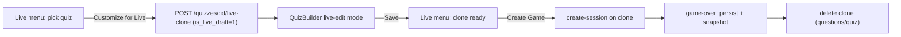

# Timer Modes + Live-Only Quiz Editor

Two independent features.

**Confirmed decisions:**
- Single timer-mode selector per quiz.
- Whole-quiz timer applies to **solo only** (live falls back to per-question).
- Live edits use an **ephemeral hidden clone**, auto-deleted after the game.
- After editing, the host returns to the Live menu to press Create Game.
- Question data is **snapshotted** into live-game analytics so the clone can be safely deleted.

---

## Part A — Timer Modes

Today timing is quiz-level only: `quizzes.time_per_question` (default 30). We add a `timer_mode` and the extra storage it needs, plus a shared resolver used by solo + live + builder preview.

### A1. Schema — `backend/db/schema.sql`

Add to the `quizzes` CREATE (lines 36-50) and mirror as `ALTER TABLE ... ADD COLUMN IF NOT EXISTS` in the ALTER block (after line 255):

- `timer_mode TEXT DEFAULT 'fixed'` — one of `fixed` | `whole_quiz` | `per_question` | `per_type`
- `total_time INTEGER` — total seconds, `whole_quiz` mode
- `type_time_config TEXT` — JSON map `{ mcq: 20, image: 30, ... }`, `per_type` mode

`questions` gets `time_limit INTEGER` (`per_question` mode), added to CREATE (lines 53-70) and ALTER block.

Keep `time_per_question` as the fixed-mode value and universal fallback (backward compatible).

### A2. Resolver util — new `backend/utils/timing.js`

- `resolveQuestionSeconds(quiz, question)`:
  - `per_question` -> `question.time_limit || quiz.time_per_question`
  - `per_type` -> `JSON.parse(quiz.type_time_config)[question.type] || quiz.time_per_question`
  - `whole_quiz` / `fixed` / default -> `quiz.time_per_question`
- `resolveTotalSeconds(quiz, questions)` -> `total_time` for `whole_quiz`, else sum of per-question resolved seconds.

Mirror both in new `frontend/src/utils/timing.js` for the player and builder preview.

### A3. Backend routes — `backend/routes/quizzes.js`

- `insertQuizWithQuestions` (lines 61-83): persist `timer_mode`, `total_time`, `type_time_config`, and per-question `time_limit`.
- `POST /` (749) and `PUT /:id` (769-837): accept `timerMode`, `totalTime`, `typeTimeConfig` (stringify), and `q.timeLimit`.
- `GET /:id/edit` (602) and player `GET /:id` (528): return the new quiz fields and include `time_limit` in each question payload (player route must expose it without leaking answers).

### A4. Solo player — `frontend/src/pages/QuizPlayer.jsx`

- Per-question start (line 240) and `timeRemaining` (line 311): use `resolveQuestionSeconds` instead of raw `time_per_question`.
- `whole_quiz`: start one deadline at quiz load (`now + total_time*1000`), tick it in a dedicated effect, do **NOT** reset per question; on 0 auto-submit current answer and finish the quiz. Gate the per-question countdown so it only runs in the other three modes.

### A5. Live game — `backend/socket.js`

- `create-session` (285-350): copy `timer_mode`, `total_time`, `type_time_config` onto the in-memory session.
- `sendNextQuestion` (245-276) and `finalizeUnansweredForCurrentQuestion` (50): compute `questionLimitMs` via `resolveQuestionSeconds(session, question)`; emit that as `timeLimit`. `whole_quiz` uses the per-question fallback (per decision).

### A6. Builder UI — `frontend/src/pages/QuizBuilder.jsx`

- Quiz state (245) gains `timerMode`, `totalTime`, `typeTimeConfig`; `createEmptyQuestion` (308) and edit-load mapping (281-300) gain `timeLimit`.
- Add a "Timer Mode" select near the existing Time field (422-429). Conditionally render: `fixed` -> current field; `whole_quiz` -> Total Quiz Time field; `per_question` -> a Time input inside each question editor; `per_type` -> a compact grid of the 9 `Q_TYPES` each with a seconds input.
- Total-time preview (927) uses `resolveTotalSeconds`.

---

## Part B — Live-Only Quiz Editor via Ephemeral Clone

Flow: Live menu -> pick quiz -> button clones quiz into a hidden `is_live_draft` copy and opens it in the Quiz Editor -> host edits (live-only) -> save returns to Live menu with the clone ready -> Create Game hosts the clone -> after game the clone is deleted, analytics preserved via snapshots.

### B1. Schema — `backend/db/schema.sql`

- `quizzes`: `ALTER ... ADD COLUMN IF NOT EXISTS is_live_draft INTEGER DEFAULT 0` (hidden flag).
- `live_sessions`: add `quiz_title TEXT`, `quiz_time_per_question INTEGER` snapshots; relax `quiz_id` FK (line 133) to nullable + `ON DELETE SET NULL`.
- `live_game_answers`: add `question_snapshot TEXT` (JSON: text/type/options/correct_answer/explanation/media_url/points/slider*/matching_pairs); relax `question_id` FK (line 289) to nullable + `ON DELETE SET NULL`.

Do the FK relaxations as `DROP CONSTRAINT IF EXISTS` + re-add in the ALTER block (same pattern already used at lines 312-315).

### B2. Clone endpoint + draft filtering — `backend/routes/quizzes.js`

- New `POST /:id/live-clone` (auth, teacher/admin, same ownership rules as `create-session`): duplicate the quiz + all questions into a new row with `is_live_draft=1`, `is_published=0`, `created_by=req.user.id`, copying every timer field and per-question field (incl. `time_limit`). Return `{ id }`.
- Exclude drafts from listings: `my-quizzes` (line 435) and published list (469) get `AND (is_live_draft = 0 OR is_live_draft IS NULL)`. Also filter admin quiz lists in `backend/routes/admin.js` (unit-quizzes 311, stats 463) so clones never surface.
- Frontend API: add `createLiveClone: (id) => request('/quizzes/' + id + '/live-clone', { method: 'POST' })` in `frontend/src/api/index.js`.

### B3. Live menu + editor wiring

- `frontend/src/pages/LiveGame.jsx`: the menu button (617) becomes "Customize for Live Game" -> `createLiveClone(selectedQuiz)` then `navigate('/quiz-builder/'+id, { state: { liveEdit: true } })`. When the menu is entered with `location.state.liveDraftReady`, render a "Live copy ready" card with Create Game (calls `createSession` with the clone id, bypassing the dropdown) and an Edit-again link. (Optional small "Host without editing" link keeps the old direct path.)
- `frontend/src/pages/QuizBuilder.jsx`: detect `location.state.liveEdit`; show a banner "Editing a live-only copy — changes apply to this game only"; on save (330-343) call `quizAPI.update(id, data)` then `navigate('/live', { state: { quizId: id, liveDraftReady: true } })` instead of `/teacher`; hide Publish in this mode.

### B4. Snapshot + auto-delete — `backend/socket.js`

- `create-session`: store `quiz.title` and `quiz.time_per_question` into the `live_sessions` INSERT (new snapshot columns).
- `persistLiveGameResults` (106-175): also write `question_snapshot` JSON per answer from the in-memory `session.questions` row.
- `game-over` branch (219-232): after `persistLiveGameResults` resolves, if the session quiz is a live draft, `DELETE FROM quizzes WHERE id = <clone>` (cascades to questions; the relaxed FKs null out `live_sessions.quiz_id` and `live_game_answers.question_id`, leaving analytics rows intact). **Guard so a failed persist does not delete.**
- Abandoned drafts (host edits then never hosts / disconnects in waiting): add a lightweight sweep that deletes `is_live_draft=1` quizzes with no active in-memory session older than a few hours.

### B5. Analytics read fallbacks — `backend/routes/admin.js`

Make the three live endpoints survive a deleted clone by switching to LEFT JOINs + COALESCE onto the snapshots:

- `/students/:id/live-games` (1097-1116): `LEFT JOIN quizzes`, `COALESCE(q.title, ls.quiz_title)`.
- `/live-games/:attemptId/detail` (1149-1180): same quiz COALESCE + `COALESCE(q.time_per_question, ls.quiz_time_per_question)`; for the per-answer query switch `JOIN questions` -> `LEFT JOIN questions` and COALESCE each field with `question_snapshot->>'...'` (Postgres JSON).
- `/students/:id/live-report` (1281-1312) and its selection/answer sub-queries (1342-1364): same LEFT JOIN + COALESCE treatment.

---

## Notes / risks

- Existing quizzes default to `timer_mode='fixed'`, so current behavior is unchanged until a mode is picked.
- The snapshot columns make live analytics self-contained; this also fixes the pre-existing fragility where deleting a source quiz would have broken past live reports.
- After schema edits the app must be restarted so `schema.sql` re-applies the new ALTERs (the DB auto-applies on boot).
